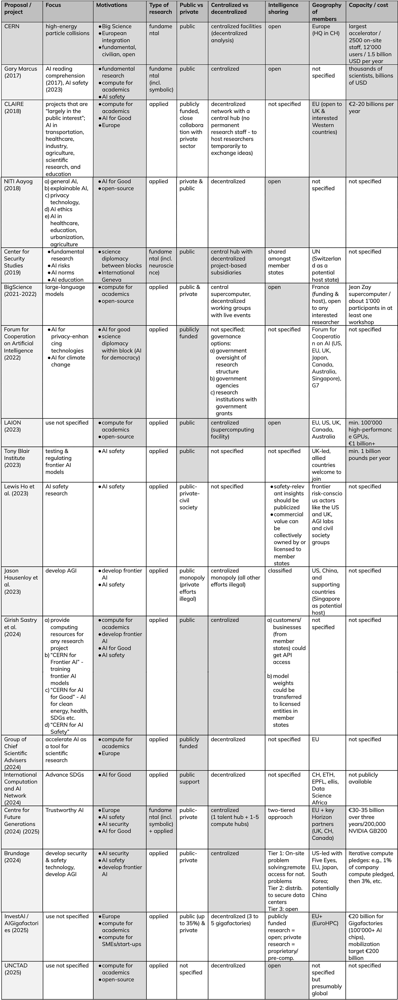

The idea of a “CERN for AI” was first proposed by cognitive scientist Gary Marcus at the AI for Good Summit [in 2017](https://www.nytimes.com/2017/07/29/opinion/sunday/artificial-intelligence-is-stuck-heres-how-to-move-it-forward.html). He invoked CERN, the European Organization for Nuclear Research, as a model of international, publicly funded scientific collaboration that could be replicated for AI.

Since then, the idea of a “CERN for AI” has gained momentum in AI governance. The idea has received support from actors as diverse as Turing Award winner Yoshua Bengio, researchers at leading U.S. AI companies, French and German academic coalitions, think tanks in the U.K., and India, to Switzerland’s Strategy for Digital Foreign Policy and the United Nations Conference on Trade and Development (UNCTAD). Indeed, “CERN for AI” is no longer just an idea, it has entered the policy agendas of key decision makers. At the 2025 Paris AI Summit, European Commission President Ursula von der Leyen launched a €20 billion CERN-inspired [“AI Gigafactories”](https://digital-strategy.ec.europa.eu/en/policies/ai-factories) initiative to accelerate public compute infrastructure across Europe:

> “We want to replicate the success story of the CERN laboratory in Geneva. CERN hosts the largest particle accelerator in the world. And it allows the best and the brightest minds in the world to work together. We want the same to happen in our AI Gigafactories. We provide the infrastructure for large computational power. Researchers, entrepreneurs and investors will be able to join forces.” 
>
> \- [Ursula von der Leyen, 2025](https://ec.europa.eu/commission/presscorner/detail/en/SPEECH_25_471)

At the same time, the “CERN for AI” label does not always refer to the same underlying ideas. Some proponents imagine a publicly funded counterweight to commercial AI labs, focused on open science and AI applications for socially beneficial purposes. Others imagine an International AI Safety Institute, that tests frontier AI models and advises regulators. Yet others envision it as a way to ensure European competitiveness in compute infrastructure. Yet, yet, others imagine it as a joint international project to develop frontier AI models.

This discussion paper is intended as an input to the [Geneva Security Debate](https://www.gcsp.ch/events/cern-ai-models-international-technical-cooperation-ai-geneva-security-debate) hosted on July 10, 2025, at the Geneva Centre for Security Policy on the margins of the AI for Good Summit. 

The first section offers context on the structure and historical motivations for CERN. The second section provides a comparison of 14 prominent proposals and 3 existing projects that have used the “CERN for AI” label. Finally, a few key discussion questions are highlighted.

## 1. How CERN works

CERN is the world’s leading institute on particle physics and operates the world’s biggest particle accelerator, the Large Hadron Collider. In 2012, the accelerator confirmed the existence of the Higgs boson, a finding for which the Nobel Prize in Physics was awarded in 2013. CERN describes [its mission](https://home.cern/about/who-we-are/our-mission) on its website as follows:

* perform world-class research in fundamental physics.
* provide a unique range of particle accelerator facilities that enable research at the forefront of human knowledge, in an environmentally responsible and sustainable way.
* unite people from all over the world to push the frontiers of science and technology, for the benefit of all.
* train new generations of physicists, engineers and technicians, and engage all citizens in research and in the values of science.

### a) Governance structure

CERN is governed by a [Council](https://home.cern/about/who-we-are/our-governance) composed of representatives from its [25 member states](https://home.cern/about/who-we-are/our-governance/member-states). Each member state has two representatives: one from the government and one from the scientific community. Each country has one vote, and all decisions aim for consensus. The organization operates a central laboratory in Geneva, Switzerland, with about 2’500 staff, while the research community is highly decentralized. A significant share of CERN’s 12’000 scientific users come from non-member states.

### b) Motivations for CERN

**Cost-sharing for “big science”:** Particle accelerators are expensive, indivisible, and central to fundamental discoveries. After World War II, European countries lacked the capacity to fund such infrastructure alone. CERN’s cost-sharing model allowed Europe to pool resources and maintain scientific leadership in high-energy physics. Its annual budget is around [1.4 billion CHF,](https://cds.cern.ch/record/2888205/files/English.pdf#page=18) with member state contributions roughly proportional to GDP.

**European Integration:** Even though CERN is based in Geneva, it is not a UN organization. The United States, China, and Russia are all not member states of CERN. Instead, CERN’s founding in 1954 reflected broader efforts to rebuild trust and cooperation in post-war Europe. Scientists from former adversary nations worked side by side on unclassified, civilian research, helping build a European [scientific identity](https://www.tandfonline.com/doi/abs/10.1080/00963402.1970.11457764).

**Civilian and open by design:** Unlike nuclear research centers in the [US](https://en.wikipedia.org/wiki/Brookhaven_National_Laboratory) or [UK](https://en.wikipedia.org/wiki/Atomic_Energy_Research_Establishment), CERN conducts only fundamental, non-military research. This restriction, which is [enshrined](https://council.web.cern.ch/en/content/convention-establishment-european-organization-nuclear-research#2) in its founding convention, helped enable full openness. Research results are published, data and software are open, and all work is civilian. This decision is directly tied to the geography of its membership. Having “the Germans in” meant having “the reactors out” as Germany had [strict postwar restrictions](https://tile.loc.gov/storage-services/service/ll/llmlp/61035888_Volume-III/61035888_Volume-III.pdf#page=120) on dual-use nuclear research.

### c) CERN vs. AI research

The CERN model can serve as an important inspiration and discussion starter for AI governance, but any AI-focused proposal should ultimately be adapted to its own context. Selected differences between particle physics and AI include: 

**Commercial interest in research:** Particle physics relies entirely on public funding due to high costs and uncertain returns. By contrast, AI is commercially lucrative, with private labs like DeepMind operating at CERN-scale budgets. Even fundamental AI research often finds private support, challenging the need for a purely public counterpart.

**Dual use and misuse risks of research:** Nuclear research has always raised concerns about military use and dual-use. However, CERN was intentionally limited in its focus on fundamental physics with minimal relevance to both nuclear weapons and nuclear reactors. This in turn has enabled a strong [open-science policy](https://cds.cern.ch/record/2835057/files/CERN-OPEN-2022-013.pdf). If we compare fundamental particle physics with the entire field of AI, it’s clear that the latter has a much larger risk of dual use and misuse. Indeed, historically, the least open part of CERN’s own history was not its physics research, but its [high-performance computing infrastructure](https://www.degruyterbrill.com/document/doi/10.7208/chicago/9780226820378-005/html?lang=en&srsltid=AfmBOoqPMluNJMhiD7lzih9AphTH5WmITG-cjkKeyMDQk4_-_zHQiGv5). So, a “CERN for AI” would likely either need clear restrictions on the types of AI research conducted or a tiered access policy.

## 2. “CERN for AI” proposals

The following is a high-level overview of proposals that have been framed as a “CERN for AI”. The entries are in chronological order. The first column reflects the proposing authors or their institutional affiliation. Dark grey backgrounds indicate areas where a proposal has substantial similarity to CERN. 

To manage the ballooning mental complexity of divergent “CERN for AI” proposals, it makes sense to think of them in four overlapping clusters:

### a) CERN for AI Academics

**Vision:** Publicly funded AI research infrastructure to rebalance power between academia and industry.

**Rationale:** The academic sector is increasingly outpaced by commercial labs in compute and AI talent. This cluster argues for “big science” in AI, with these large-scale public investments expected to enable open, fundamental research. Proponents also argue this would address private sector neglect of AI for Good and AI safety.

**Examples:**

* **[CLAIRE](https://cairne.eu/wp-content/uploads/2019/10/CLAIRE-vision.pdf) (EU):** European academic network that calls for large-scale public AI funding and infrastructure to match the ambitions of private tech companies and maintain European sovereignty.
* **[BigScience](https://bigscience.huggingface.co/) (France):** Project to create an open-source large language model involving academic and volunteer communities, supported by public computing power.
* **[Group of Chief Scientific Advisers](https://op.europa.eu/en/publication-detail/-/publication/d6d8ed54-32a8-11ef-a61b-01aa75ed71a1/language-en) (EU):** Recommended increased support for AI in science via public compute infrastructure.

### b) CERN for AI for Good

**Vision:** A global or regional public institution focused on socially beneficial AI.

**Rationale:** Market incentives may overlook socially beneficial AI applications in domains like climate, healthcare, and education. This cluster promotes AI aligned with Sustainable Development Goals (SDGs).

**Examples:**

* **[NITI Aayog](https://indiaai.gov.in/documents/pdf/NationalStrategy-for-AI-Discussion-Paper.pdf#page=61) (India):** Called for more research to ensure that AI is inclusive and good, including explainability, privacy, AI for development.
* **[International Computation & AI Network](https://icain.ch/index.html) (CH):** Project co-led by academic networks, this initiative aims to provide publicly supported AI compute to support research on SDGs in low- and middle-income countries.
* **[Forum for Cooperation on AI](https://www.brookings.edu/wp-content/uploads/2022/11/FCAI-October-2022.pdf) (US):** Called for research focusing on privacy-enhancing technologies and AI as a tool for climate change monitoring and management. AI that supports democratic values.

### c) CERN for AI Safety

**Vision:** A publicly backed hub to accelerate safety research, risk assessment, and testing for frontier AI models.

**Rationale:** Private labs may underinvest in safety and transparency. A CERN-like institution could serve as a coordination point for red-teaming, evaluation, and safety tooling.

**Examples:**

* **[Gary Marcus](https://garymarcus.substack.com/p/a-cern-for-ai-and-the-global-governance) (2023):** Proposed a global, neutral, non-profit International Agency for AI that develops technical solutions to promote safe, secure and peaceful AI technologies.
* **[Tony Blair Institute](https://institute.global/insights/politics-and-governance/new-national-purpose-ai-promises-world-leading-future-of-britain) (UK):** Recommended a public laboratory focused on researching and testing safe AI that also acts as a regulatory sandbox (becoming the “brain” for regulators).
* **[Centre for Future Generations](https://cfg.eu/cern-for-ai-eu-report/) (EU):** Has called for a “CERN for Trustworthy AI”, making solving the scientific problem of trustworthy AI its core mission, and tackling it through multiple, targeted research bets.

### d) CERN for AGI 

**Vision:** An international lab jointly developing [artificial general intelligence](https://www.simoninstitute.ch/blog/post/what-is-artificial-general-intelligence-agi-an-explainer-for-policymakers/), in some proposals with monopoly power.

**Rationale:** Reduce risks of competitive races and dual-use misuse by pooling efforts into a single high-capacity global lab.

**Examples:**

* **[Hausenloy et al.](https://arxiv.org/pdf/2310.09217):** Proposed creating an international public monopoly on AGI development.
* **[Sastry et al.](https://arxiv.org/pdf/2402.08797) (one option):** Proposed a “CERN for Frontier AI” with shared model access.
* **[Brundage](https://milesbrundage.substack.com/p/my-recent-lecture-at-berkeley-and):** Recommended a 5-4-5 plan: First achieve RAND [security level 5](https://www.rand.org/pubs/research_reports/RRA2849-1.html) to protect AI model weights. Then figure out how to achieve Anthropic’s [AI Safety Level 4](https://www-cdn.anthropic.com/872c653b2d0501d6ab44cf87f43e1dc4853e4d37.pdf). Then build and distribute the benefits of [level 5 AGI](https://www.bloomberg.com/news/articles/2024-07-11/openai-sets-levels-to-track-progress-toward-superintelligent-ai) capabilities defined by OpenAI as AI systems resembling the behavior and intelligence of a human-run organization.

## Open questions

The following are some relevant discussion questions with regards to “CERN for AI” models.

### a) What types of AI research are insufficiently provided by markets?

Fundamental research has often been framed as a global public good, work that benefits many but is difficult to monetize, and therefore underfunded by private actors. Many companies are doing serious work in fundamental AI. However, there are still areas that have been suggested as neglected by different parties:

* **AI for Good:** Applications of AI for public benefit, such as healthcare, agriculture, and education, often with a particular focus on developing countries.
* **Neurosymbolic AI:** This approach combines neural networks with symbolic reasoning to improve how models think, explain themselves, and reason through problems. 
* **AI safety & security:** As models become more powerful, they also become harder to predict and harder to control. There's increasing recognition that we need better tools to test and verify what these systems can and can’t do.

Should a CERN for AI prioritize one or multiple of these areas? 

### b) Should Europe’s AI Gigafactories be compared to US tech giants or to national AI research resources?

AI Gigafactories in Europe are sometimes benchmarked against the hyperscale data centers of U.S. tech giants. However, the infrastructure of companies like Google or Microsoft is supported by products, cash flows, and massive user bases. The EU has no comparable business model attached to Gigafactories.

Instead, the Gigafactories seem to follow the model of the European High Performance Computing Joint Undertaking (EuroHPC): academic researchers apply for free access, while companies can use the resources for a fee. As such, they would be functionally closer to the US National AI Research Resource (NAIRR) or the UK AI Research Resource (AIRR). At the same time,  with over $7 billion/year in public spending, Gigafactories are more than ten times larger than their US and UK equivalents. 

This raises questions about sustainability, usage, and strategic intent: is the goal enabling academic science, or establishing geopolitical parity?

### c) How to handle the trade-off between open-source and misuse risks?

Open-source AI promotes transparency, collaboration, and diffusion, but it also carries risks when powerful models with dangerous capabilities are made widely accessible. This tension is especially sharp for general-purpose foundation models. Some proposals suggest tiered levels of openness, remote access to AI models, or license-based release of models. What governance frameworks might balance these competing priorities?

### d) Do we need a single centralized hub vs. a decentralized network?

The original CERN model combines centralized infrastructure with decentralized research and analysis, and shared governance between member states. In AI, both centralized and decentralized designs are being proposed with regards to:

* **Human talent:** “herding nerds” in a central hub vs. a talent network
* **Computing power:** one very large datacenter vs. multiple, geographically spread datacenters
* **Governance:** who decides on research or model releases

The advantages and disadvantages of these designs depend on a range of factors, including the goals of the institution. For example, centralized compute infrastructure might make it easier to enforce very high security standards as some have argued, but it might be easier to spread the AI chips based on energy availability and political buy-in from multiple countries. Which combination is the most fitting and for which “CERN for AI” proposal?

### e) How does “CERN for AI” compare to other models for international technical cooperation on AI and/or European competitiveness in AI? 

It’s good to consider a broader range of analogies and models for the goal that “CERN for AI” aims to achieve. For example, Europe has top academic talent, strong regulatory frameworks, and a strong tradition of public investment. However, it lags behind the US and China in its commercial AI ecosystem. What mix of public-private coordination might be needed to foster both competitiveness and trustworthiness? What other models of international technical cooperation should be considered?