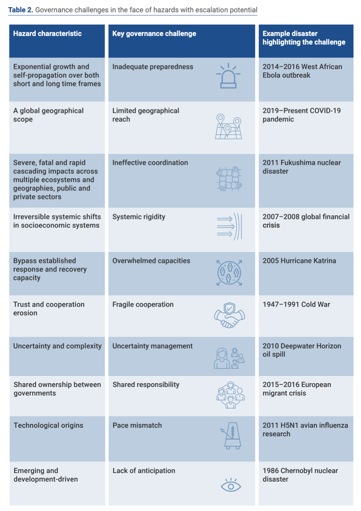

In 2021, UN-Secretary General António Guterres issued ['Our Common Agenda'](https://www.un.org/en/common-agenda), a report outlining a vision for the future of global cooperation. In the report, he states: 

> “Our success in finding solutions to the interlinked problems we face hinges on our ability to anticipate, prevent and prepare for major risks to come. \[...] Continued technological advances, accelerating climate change and the rise in zoonotic diseases mean the likelihood of extreme, global catastrophic or even existential risks is present on multiple, interrelated fronts. An effort is warranted to better define and identify the extreme, catastrophic and existential risks that we face.” 

The international community increasingly seeks to understand the large-scale risks we face, and the role institutions can play in better preventing, preparing and managing the hazards that give rise to these risks. In response to this growing demand, the Simon Institute for Longterm Governance (SI) partnered with the [United Nations Office for Disaster Risk Reduction](https://www.undrr.org/) (UNDRR) and the [International Science Council](https://council.science/) (ISC) to produce a report on hazards that have the potential to lead to catastrophic or existential risks, and strategies for governing the forces that drive them. You can download the full report [here](https://www.undrr.org/publication/hazards-escalation-potential-governing-drivers-global-and-existential-catastrophes). 

Hazards with escalation potential are those that, when combined with additional vulnerabilities, possess the capacity to develop into global catastrophic or existential risks – events that could lead to a global population loss exceeding 10% or the irreversible collapse of humanity. These hazards often exhibit common characteristics, such as far-reaching geographical impacts, an ability to affect multiple sectors, or the potential to grow exponentially. Notably, they have the capacity to disrupt multiple interconnected systems (e.g. the internet and other global communication networks) and can bypass established response mechanisms (e.g. an emergency response system reliant upon internet access). 

Nuclear explosions are an example of a hazard with escalation potential. Nuclear explosions of significant intensity or occurring successively could lead to nuclear winters – prolonged periods marked by freezing temperatures due to sunlight and heat obstruction from soot and smoke. Coupled with widespread fires and the consequent dispersion of toxic materials, such events could result in extensive destruction, widespread food scarcity, and a death toll surpassing 5 billion. 

Overall, this report aimed to identify hazards with a similar potential to escalate and cause global-scale catastrophes. To do so, the authors reviewed existing literature on catastrophic and existential risks, conducted a survey with over 250 domain experts on various hazard types, and sought additional expert consultations. In total, among the 302 hazards cataloged in the [Hazard Information Profiles](https://undrr.org/publication/hazard-information-profiles-hips) developed by the UNDRR and the ISC, a subset of 10 geological, biological, technological, and social hazards were identified as possessing global escalation potential. They further identified climate change and artificial intelligence as the two most influential forces capable of creating, altering, or exacerbating these threats. 

The report argues that the characteristics shared by these 10 hazards with escalation potential and two influential forces warrant greater government attention. Most disaster prevention and response mechanisms are not fit-for purpose to manage these types of risks. Governance systems tend to be prepared to respond to events of common frequency and manageable magnitude, but not to worst case scenarios. Events like Ebola and COVID-19 can provide valuable insights into escalation patterns and vulnerabilities in disaster response systems for risk governance actors. A comprehensive understanding of the shared traits among escalating hazards can similarly help by refining risk modeling and aiding in identifying actions that effectively halt disaster expansion.

The report further highlights that future disasters may become increasingly complex in nature, potentially combining all characteristics outlined in the table above. Should such an event occur, a global or existential catastrophe could ensue. In light of these threats, the authors call for the international risk governance community to focus greater attention on hazards with escalation potential, and the forces that drive their development. If governments can effectively address the most severe threats, their ability to respond to all hazards will improve significantly.