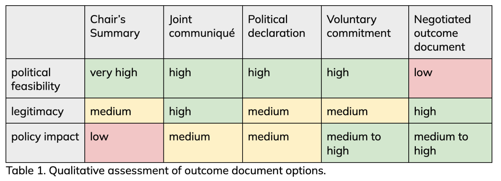

Member States at the United Nations are currently [negotiating](https://www.un.org/global-digital-compact/en/ai) the modalities of the [Global Dialogue on AI Governance](https://www.un.org/global-digital-compact/en/ai). **The outcome document of the dialogue remains uncertain and is a likely point of contention.** The [zero draft](https://www.un.org/global-digital-compact/sites/default/files/2025-03/ai_panel_and_dialogue_zero_draft_19_march_2025.pdf) requests that the Dialogue’s co-chairs “prepare a summary of the Dialogue,” which would provide published information on the content of the dialogue but would include no political signal. [The G77](https://www.simoninstitute.ch/blog/post/response-to-the-g77-proposal-on-the-independent-international-scientific-panel-on-ai/) have advocated instead for a formal intergovernmental process (with preparatory sessions) that would culminate in a “an inter-governmentally negotiated outcome document”. However, many Western countries view a negotiated outcome document as a red line, preferring a less formal, more flexible approach. 

In this blog post, we discuss both of the proposed approaches as well as additional options that might be acceptable to stakeholders: A chair’s summary, a joint communiqué, a political declaration, a voluntary commitment, and a negotiated outcome document.

### 1. Chair’s Summary (politically not endorsed summary)

This format has been suggested by the co-facilitators as an intermediary solution. **This is a text issued by the chair, co-chairs, or host of a multilateral meeting to summarize the discussions and outcomes.** Unlike a negotiated communiqué or treaty, a chair’s summary is not an agreed text. It reflects the chair’s understanding of key points raised, especially when participants do not forge a consensus. 

A chair’s summary is sometimes used to reflect the advancement of the discussion in areas where common ground remains limited. For example, the UN Open-ended Working Group on Developments in the Field of Information and Telecommunications in the Context of International Security has attached a [Chair’s Summary](https://front.un-arm.org/wp-content/uploads/2021/03/Chairs-Summary-A-AC.290-2021-CRP.3-technical-reissue.pdf) alongside its [consensus report](https://front.un-arm.org/wp-content/uploads/2021/03/Final-report-A-AC.290-2021-CRP.2.pdf), to capture additional discussion points that were not part of the agreed text. Several G20 ministerial meetings have issued a Chair’s Summary instead of a full joint communiqué, due to disagreements on certain paragraphs.

**We assess a Chair’s Summary as rating very high on political feasibility, medium on legitimacy, and low on policy impact.** The biggest strength of a summary document is that it places relatively few demands on member states. The document would retain some of the legitimacy of the dialogue, as it would provide insight into discussions, but would have less political legitimacy than a statement formally endorsed by member states. 

The biggest disadvantage of a Chair’s Summary is likely to be its limited policy impact. The Summary provides information about the content of discussions but it remains removed from negotiations or policy commitments.

### 2. Joint communiqué (politically endorsed summary)

**This is a collective announcement issued by the participants of a multilateral meeting.** This is typically a consensus-based document that summarizes the outcomes of discussions, shared views, and, often, highlights some next steps in the meeting format. A joint communiqué is more formal than a chair’s summary because it is agreed to by all parties. Yet, they remain legally non-binding and they mostly review what has been discussed. Communiqués are common at summits (e.g. G7, G20, ASEAN) and ministerial meetings to signal unity and outline common agendas. 

**We assess a joint communiqué as rating high on political feasibility, high on legitimacy, and medium on policy impact.** The text of a communiqué is usually negotiated during a summit or dialogue. Because communiqués tend to be quite general and broad, they are often not controversial, although even under such circumstances, member states may not always reach agreement, as occurred in the recent Paris AI Action Summit. These types of joint statements typically have high political legitimacy, as they represent the views of all member states in attendance. Policy impact may vary considerably but at a minimum, joint communiques can help draw attention to an issue. 

### 3. Political declaration (opt-in statement)

**A political declaration is a negotiated, opt-in statement of shared principles and intent.** Rather than summarising what was said in a meeting, it sets out a forward‑looking charter that articulates a common vision and galvanises political will. Declarations such as the UN Political Declaration on HIV/AIDS in 2001 or the Bletchley Declaration on AI Safety in 2023 show how this format can define a normative agenda, mobilise resources, and steer subsequent negotiations, all without creating legal obligations. 

**We assess a political declaration as rating high on political feasibility, medium on legitimacy, and medium on policy impact.** While political declarations require negotiations, they are typically less time-intensive than negotiated outcome documents because member states can opt-in or out of the final text. Moreover, because declarations are typically vision statements rather than detailed commitments, member states may have an easier time signing on to such documents. The legitimacy of such declarations may depend in part on context: if many member states sign on to a declaration, it is likely to be viewed as more legitimate than a declaration by only a small group of states. However, the absence of strategically important states would undercut such effects.  

In terms of policy impact, this approach has both strengths and weaknesses. Political declarations can spur and galvanize policy action, but in areas where policy preferences diverge significantly, they are likely to be relatively vague and abstract. In the context of the Global Dialogue, this approach could thus result in concrete declarations and policy plans for topics that are relatively uncontroversial but few meaningful commitments on more divisive issues.  

### 4. Voluntary commitment (opt-in commitment)

**Voluntary principles or commitments, sometimes branded as a code of conduct or best‑practice guidelines, are non‑binding standards that states—and often companies—can endorse at their own pace.** Examples include the OECD AI Principles of 2019 and the UN Guiding Principles on Business and Human Rights. Their chief advantage is flexibility: early movers can signal leadership, late adopters can join without reopening negotiations, and the text itself can evolve through periodic review as technology and best practice change. By inviting endorsements from industry, academia and civil society, voluntary principles also broaden legitimacy and facilitate practical uptake. 

**We assess voluntary principles or commitments as high on political feasibility, medium on legitimacy, and medium to high on policy impact.** Similar to an opt-in statement, voluntary principles or commitments may require less contentious negotiations, as member states can choose whether to participate or opt-out, and also join at later dates. The legitimacy and policy impact of such commitments depends in part on who signs up: endorsement from a small group of likeminded stakeholders may be less impactful than broad, widespread acceptance. Policy impact will also depend on the content of commitments. In the context of the Global Dialogue, which is likely to address different topics each year, voluntary commitments could vary considerably from year to year. This additional flexibility could be advantageous, as it would allow member states a pathway for responding to emerging challenges. 

### 5. Negotiated outcome document (negotiated consensus commitment)

**In a negotiated outcome document scenario, the Global Dialogue would be designed with the goal of member states reaching a final consensus document that conveys shared policy goals or commitments.** A good example of this could be the Tunis Agenda for the Information Society, which was agreed paragraph‑by‑paragraph at a UN World Summit on the Information Society in 2005. It launched follow‑up mechanisms such as the Internet Governance Forum (IGF), and has guided digital‑policy negotiations ever since. Notably, the Tunis Agenda is a negotiated outcome document but it doesn't create binding legal obligations for countries. In that sense it is still weaker than an Intergovernmental Negotiation Committee, which could lead to a framework convention and eventually binding international treaties.

**We assess a negotiated outcome document as rating low on political feasibility, high on legitimacy, and medium to high on policy impact.** A negotiated outcome document typically places high demands on member states, as they must reach consensus during the window of negotiations. Much of the Global Dialogue could involve line-by-line negotiations over a final text, which creates many opportunities for conflict and could lead, in some years, to no outcome document. The biggest advantage of such an approach is its high level of political legitimacy: if member states reach a negotiated outcome, it sends a strong signal about broad political support for an idea. Policy impact is likely to vary from year to year, depending on the content of the outcome document. Because negotiated outcome documents are consensus commitments, they may not include detailed commitments or policy action. 

### Finding common ground

The options above are not all mutually exclusive. For example, it may be possible that there is a Chair’s summary of intergovernmental discussions, but a multistakeholder, opt-in commitment for capacity building or another issue. Above all, we hope these options highlight that output is not an all or nothing question, and that member states can find engagement formats that are acceptable to all.