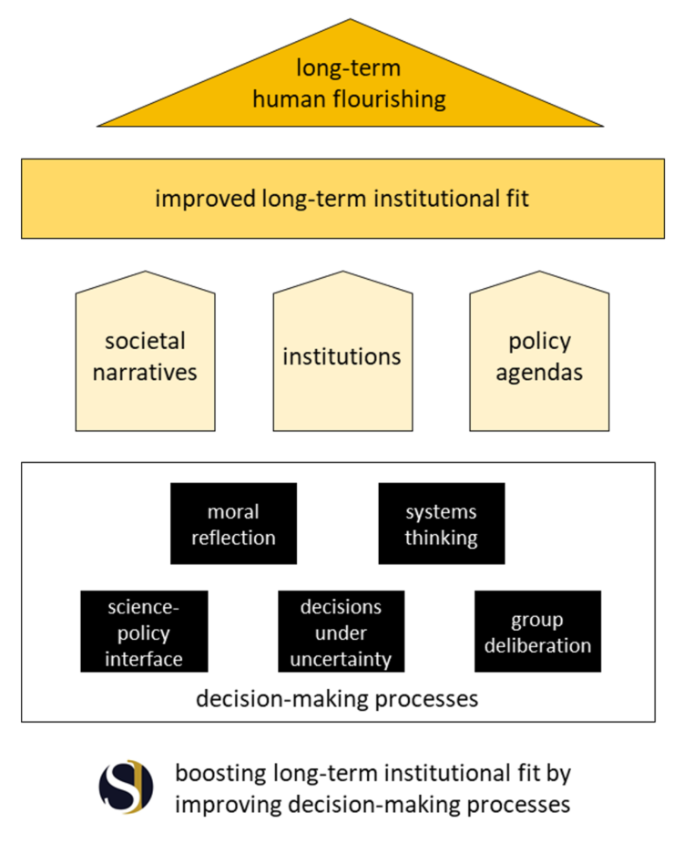

*Crescent earthrise photo restored by [Toby Ord](http://tobyord.com/earth).*

Our theory of change illustrates how we intend to contribute to the long-term flourishing of civilization. In this post, we outline our overarching strategic thinking.

If humanity survives the next few centuries, there is a fair chance that the vast majority of human life, culture, science, technology, and happiness lies ahead, rather than behind us. 

The pivotal importance of preserving our existence and increasing our chances of reaching humanity's potential is in stark contrast to the lack of weight that today's policymaking, discourse, and funding put on future generations. The Simon Institute for Longterm Governance (SI) aims to help change this.

At SI, we believe that:

* Humanity needs to anticipate and mitigate **global catastrophic risks** and build resilient systems so that civilization can survive and flourish;
* **Policymaking** in national governments and international organizations is the most influential form of explicit value-driven coordination and can, therefore, be used to help secure the existence and potential of our long-term future.

We see at least 3 avenues to improve **long-term institutional fit** – the capacity of policymaking networks to safeguard and improve the long-term potential of humanity (for more see our [Working Paper No.1](/project/public-policy-making-longterm-future/)):

* **Dominant societal narratives** must incorporate future generations and an understanding of human progress on long timeframes;
* **Institutions** must be reformed to take the interests of future generations into account;
* **Policy agendas** must account for tail risks and their interaction effects.

Improvements on these dimensions are contingent on the collective and individual decision-making processes of actors within policy networks. It is the coalescence of the perspectives and actions of elected politicians, civil servants, academics, funders, beneficiaries and interest groups that shape policymaking. It is their interaction that SI is aiming to support in order to advance long-term institutional fit. As such, our location – Geneva, a global hub for international organizations and policymaking  – is far from incidental. The proximity to a wide range of international policymakers and organizations is pivotal to SI supporting their interaction. 

Policymaking processes are driven and bound by (i) individual motivation, (ii) cognition and behavior, (iii) the quality of information available, (iv) how actors cope with uncertainty, and, finally, (v) collective dynamics within policy networks. All of these can be leveraged to boost long-term institutional fit. 

At SI, we aim to improve **policymaking** through:

* **Fostering moral reflection:** Moral philosophy is unlikely to become the primary driver of policymaking, nor does it have to in order to contribute to progress. Despite constraints and competing motivations, strengthening moral reflection can increase good faith among policy networks, and incrementally reinforce standards of moral integrity.
* **Training systems thinking:** Building appropriate mental models of systems can efficiently bridge the discrepancy between systemic complexity and the cognitive limitations of actors within these systems.
* **Improving the science-policy interface:** To facilitate research uptake in policymaking, science-policy ecosystems can be enhanced especially through the work of interface actors that facilitate lasting collaborations between scientists and policy actors.
* **Training decision-making under uncertainty:** The field of decision-making under deep uncertainty has developed cognitive and digital tools with empirical backing, the literature on superforecasting provides a treasure trove of information on robust, adaptive decision-making under uncertainty. People who tend to perform extraordinarily well at this type of judgement are humble, self-aware, pragmatic analysts with a probabilistic worldview who continuously strive to improve.
* **Facilitating group deliberation:** It is important to understand political decision-making as a collective phenomenon and thus improve how consensus is reached by alleviating information asymmetries and supporting deliberation processes. Decision-making support must account for group-specific particularities. The field of social psychology has aggregated a number of promising leverage points for improving collective decision-making.

SI enables the above in distinct ways: We are both uniquely narrow in our focus on the long term and uniquely broad in the type of support we offer. SI goes beyond supplying knowledge to policy networks or facilitating interaction between experts and decision-makers. We equip policy actors with tools to handle information overload and facilitate collective decision-making. For impact to last, we are building a community of practice around these tools and ideas.

Humanity's status quo sees our long-term future grossly underrepresented in policymaking. SI’s mission is to increase the capacity of policy networks to mitigate global catastrophic risks and foster systemic learning for civilization to flourish. We aim to achieve this by boosting long-term institutional fit through improving the decision-making processes of actors in policy networks. We are starting by working with international organizations, member states, academia and civil society around the United Nations.

There is no reason why humanity's long-term future cannot be vast. There is no reason why we would not be able to fulfil a potential much greater than what past generations have built for us.
