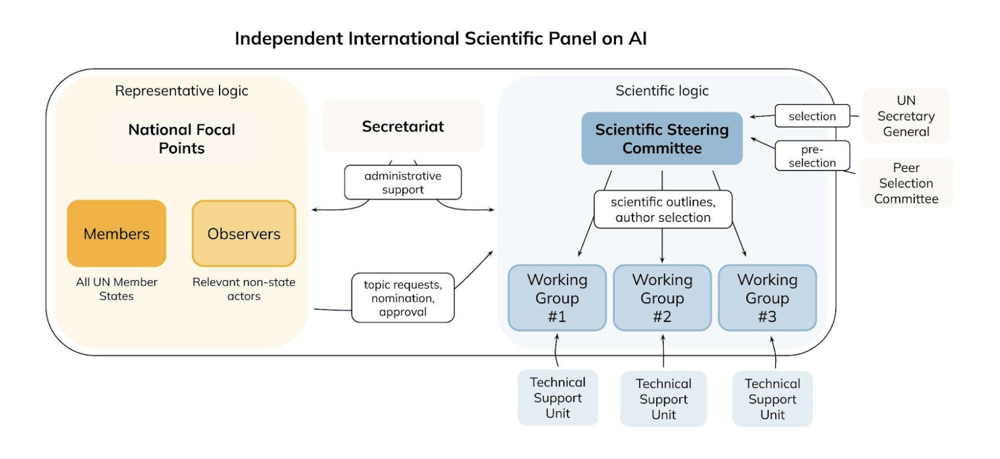
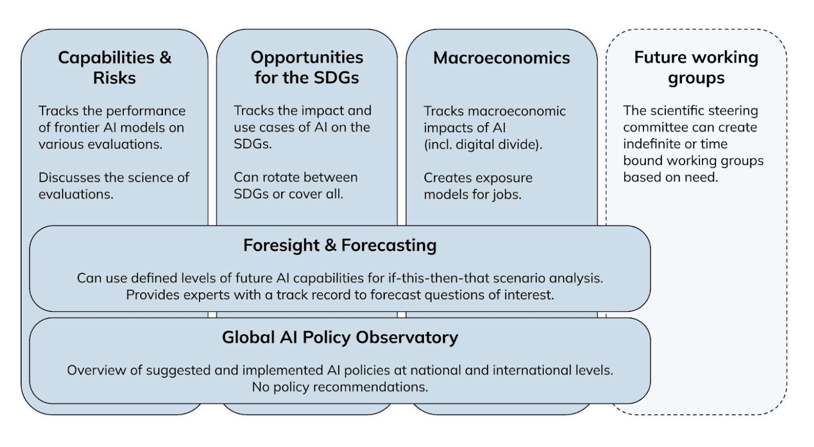

In September 2024, the UN General Assembly adopted the [Global Digital Compact (GDC)](https://www.un.org/digital-emerging-technologies/global-digital-compact), which mandated the creation of the Independent International Scientific Panel on AI and the Global Dialogue on AI Governance. We have been following this process closely with an [interim report](https://www.simoninstitute.ch/blog/post/blueprints-design-options-for-the-independent-international-scientific-panel-on-ai-and-the-global-dialogue-on-ai-governance/) on design options, [workshops](https://www.simoninstitute.ch/blog/post/developing-the-modalities-of-the-independent-international-scientific-panel-on-ai-the-global-dialogue-on-ai-governance-a-workshop-series/) with stakeholders, and blog posts on [the dialogue](https://www.simoninstitute.ch/blog/post/distinguishing-between-internet-governance-and-ai-governance/) and on [the panel](https://www.simoninstitute.ch/blog/post/three-considerations-for-the-independent-international-scientific-panel-on-ai/). We are now happy to **[publish a full set of recommendations](https://drive.google.com/file/d/17mBzqt7foXThI9xcAP8gsTKan34Zk5Mv/view?usp=sharing)** on the set-up of these two institutions.

We encourage stakeholders to read **[the full report](https://drive.google.com/file/d/17mBzqt7foXThI9xcAP8gsTKan34Zk5Mv/view)**. However, the following is a high-level overview of the suggested set-up:

### Recommended elements of the panel

A well-designed international AI panel should balance inclusivity, scientific rigor, and practical efficiency. The following elements outline the basic structure we recommend:

**National focal points:** Membership to the panel should be open to all UN Member States, ensuring equal participation and broad geographic representation. National focal points should be one government-designated expert per government. Focal points can request topics and nominate experts as authors and Steering Committee Members. The national focal points should convene at least once a year to review the annual Global AI Assessments, discussing it with its authors, and noting dissent on specific wordings. Observers from relevant non-state actors can join and nominate but they have no voting rights.

**Secretariat:** An administrative body is essential to coordinate logistics, manage communications, and oversee budgeting. The Secretariat should support both the national focal points and the scientific bodies, ensuring processes run smoothly while not exerting editorial control over scientific outputs. We suggest that this functioning should either be an independently-financed entity or given to the UN Office for Digital and Emerging Technologies (ODET).

**Scientific steering committee:** This senior expert group provides strategic oversight of the panel’s scientific work. Its members are nominated by member states and observers, and selected by the UN Secretary General guided by clear evaluation criteria and the recommendations of a peer selection committee. The Steering Committee defines report outlines, establishes methodological standards, and ensures the overall coherence of the panel’s outputs.

**Working groups:** Working groups are where the in-depth research and drafting take place. Each group focuses on a specific theme and includes specialists who can devote sufficient time and expertise to produce high-quality material. Technical support units may be designated for each working group, leveraging existing institutions with relevant research capacities. 

We suggest the following concrete working groups:

### Recommended elements of the dialogue

The Global Dialogue on AI Governance is designed as an inclusive, multi-track process that integrates governments, private sector representatives, civil society, and academic experts. To ensure its effectiveness, the dialogue must balance inclusivity, stakeholder engagement, and policy relevance.

**Multistakeholder Agenda Committee:** The Multistakeholder Agenda Committee is responsible for agenda-setting. It should be composed of members from governments, academia, civil society, private sector, and multilateral organizations. The program of the dialogue is shaped by themes, the report of the Scientific Panel, and an open call for session proposals. This ensures that programming remains consistent across UN events and years, informed by both multistakeholders and the Scientific Panel.

**Multiple tracks:** To ensure broad participation from governments and all relevant stakeholders the overall dialogue should follow a multistakeholder format. However, the role of stakeholders can vary between tracks.

* **General track:** Panels, talks, events with stakeholders from all groups.
* **Business track:** Allows industry to share best practices and governance innovations.
* **Civil society track:** Focuses on AI’s societal impact, emphasizing human rights, ethics, accountability, and inclusion.
* **Government track:** Provides a dedicated space for policymakers to share AI governance strategies and regulatory approaches.

**Co-located events:** The dialogue should be co-located with existing UN events to maximize participation, efficiency, and policy impact. We have considered events primarily based on thematic alignment and engaging relevant stakeholder groups.

* AI for Good Summit (ITU, Geneva) should serve as the primary multistakeholder forum, leveraging its global AI governance track and strong UN agency participation.
* High-Level Political Forum (HLPF, New York) could potentially host the government track, linking AI governance discussions to the broader UN sustainable development agenda.
* High-Level Week (UNGA, New York) should feature an annual policy briefing by the Chair of the Scientific Panel, ensuring AI remains a priority at the highest levels. 

### The process goes on

[This report](https://drive.google.com/file/d/17mBzqt7foXThI9xcAP8gsTKan34Zk5Mv/view) reflects our current best effort to find a pragmatic design that is universal, scientific, and agile, and we hope that stakeholders view this as a constructive contribution.

Unfortunately, it is impossible to design the panel and dialogue in a way that will satisfy everyone on every single point. Hence, we do not only publish our recommendations, but we also share our reasoning for each building block in the report. Stakeholders are invited to reflect for themselves whether arguments should be weighed differently.

*Feel free to get in touch with kevin@simoninstitute.ch for any questions or to discuss these recommendations further.*