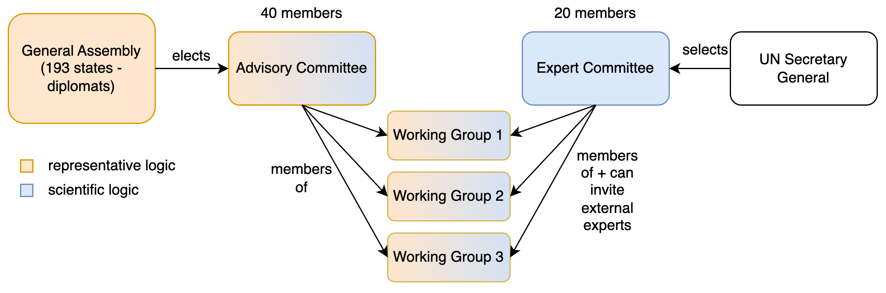
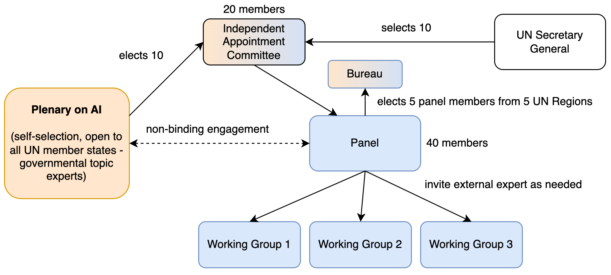

After multiple rounds of stakeholder consultations, the co-facilitators from Spain and Costa Rica have published [Revision 1](https://www.un.org/global-digital-compact/sites/default/files/2025-05/ToR%20and%20Modalities%20Rev%201%20%2815%20May%202025%29.pdf) for the modalities of the Independent International Scientific Panel on AI and the Global Dialogue on AI Governance. We welcome the new institutional design proposal, which is an **improvement** over the [Zero Draft](https://www.un.org/global-digital-compact/sites/default/files/2025-03/ai_panel_and_dialogue_zero_draft_19_march_2025.pdf), represents a reasonable **compromise** between Member States, and takes into account the concerns of **budget-conscious** actors. 

In the Zero Draft, the scientific panel had an “Advisory Committee” elected by Member States, and an “Expert Committee” selected by the UN Secretary-General, both of which could participate in working groups.

*Fig. 1: Structure of the Independent International Scientific Panel on AI in the Zero Draft.*

In the new revised structure, the scientific panel has a single 40-member scientific steering body called the “Panel”, which has a 5-member executive body called the “Bureau”. Member States and the Secretary General select a 20-member “Independent Appointment Committee”, which in turn selects the Panel.

*Fig. 2: Structure of the Independent International Scientific Panel on AI in Rev. 1.*

### Rev. 1 is an improvement

In our [response to the Zero Draft](https://www.simoninstitute.ch/blog/post/response-to-the-zero-draft-on-the-independent-international-scientific-panel-on-ai-and-the-global-dialogue-on-ai-governance/) we had discussed the desirability of the broader engagement of Member States through universal membership. At the same time, we have argued that there is a need for clearer boundaries on political influence on the scientific process. Notably, experts elected by Member States should not be directly involved in the panel’s writing process. The negotiations have addressed both issues. **Consequently, Rev. 1 proposes a panel design that has more political legitimacy and more scientific independence than in the Zero Draft.**

* **No country is left behind:** Rev. 1 leans into the comparative advantage of the UN by ensuring that all countries can contribute to and engage with the process through the Plenary on AI. This helps to establish global buy-in for a baseline of facts and trends. 
* **Stronger science-policy interface:** Having channels for structured engagement between governmental experts and scientific authors through questions, discussions, and feedback is important. This allows scientists to be more policy relevant and policymakers to better understand a scientific report, to develop trust in its findings, and to start considering actions based on it.
* **Better protection of scientific independence:** In the Zero Draft Member States would have elected an Advisory Committee that could be directly engaged in working groups. In Rev. 1, scientific members are selected by an Independent Appointment Committee. This ensures at least one degree of separation from a more political election of scientists by country representatives.

### Rev. 1 is a compromise

Getting to an agreement between 193 UN Member States requires compromises from all stakeholders. Some of these include: 

* **New York and Geneva:** During the negotiations, there has been an increasing consensus amongst stakeholders that the [AI for Good Summit](https://aiforgood.itu.int/) in Geneva, as the biggest UN event on AI, should be a host of the Global Dialogue on AI Governance. However, finding the right role for New York proved to be more contentious. Some wanted New York to be a host of the dialogue, others were strongly opposed. The co-facilitators’ solution of having a high-level launch event in New York in September 2025 followed by the first Global Dialogue on AI Governance in Geneva in 2026 seems like a good solution.
* **Formality of dialogue outcomes:** The outcome format of the Global Dialogue has been contentious too, with the G77 insisting on an intergovernmentally negotiated outcome document, and Western governments seeking to keep the format informal. Rev. 1 suggests a co-chair’s summary of the discussions, combined with one informally consulted UN General Assembly resolution in 2027. The latter roughly corresponds to a political declaration in [our framework](https://www.simoninstitute.ch/blog/post/how-formal-should-it-be-outcome-formats-for-the-global-dialogue-on-ai-governance/), as UN General Assembly resolutions are non-binding, and typically adopted by majority vote.  
* **Room for specification:** In line with our [recommendations](https://www.simoninstitute.ch/blog/post/recommendations-for-the-independent-international-scientific-panel-on-ai-and-the-global-dialogue-on-ai-governance/), we would still be supportive of pre-setting working group topics, as this could help provide focus, select the right experts, and ensure policy relevance. Similarly, we think that the precise role of the Bureau, as a new sub-body of the Panel is still underspecified in Rev. 1. However, we also recognize that unless there is a consensus on these matters, it can make sense to delegate more detailed questions to the panel and/or the organizational session in New York (except for the placeholder {DATE} in the draft).

### Rev. 1 is very budget-conscious

Compared to many other multilateral budget items, the AI panel and dialogue are “peanuts”. The panel is largely scientists “gifting” their time to help policymakers and the public to have a good overview of risks, opportunities, and impacts. The [IPCC](https://apps.ipcc.ch/eventmanager/documents/83/181120230628-Doc.%202-Prog.%20and%20Budget.pdf#page=13) and IPBES [[pdf](https://www.ipbes.net/resource-file/105062&)], which are more extensive than the AI panel in several ways, manage to do this for 5 to 10 million CHF per year. If we further break down the IPCC and IPBES budgets, two of the biggest cost items are the secretariat as well as participation support (e.g. travel grants for experts from developing countries). Rev.1 explicitly states that the secretariat must be funded “within existing resources”, and that participation support is encouraged through voluntary funding.

 Budget hawks should take this win and not “fumble” it by pushing the negotiations over the “[Szilard point](https://en.wikipedia.org/wiki/Szilard_point)”, where the bureaucratic effort required to set-up scientific work, exceeds the costs of the scientific work. In science, the well-meaning drive for grantmaking accountability has itself become a [significant bureaucratic burden](https://goodscienceproject.org/reducing-bureaucracy/) that can negatively impact efficient resource use. Let’s not repeat this.

Rev. 1 goes a long way to ensure budget responsibility. In general, our preferred way of financing is through assessed contributions, and where that’s not possible through voluntary contributions. Either way the time and effort to confirm the financing should remain in proportion to the required amount. We cannot let “the cure be worse than the problem itself.”

### Time to seal the deal

The co-facilitators [have announced](https://www.un.org/global-digital-compact/sites/default/files/2025-05/Letter%20from%20the%20Co-Facilitators%20%2815%20May%202025%29.pdf) that their goal is to wrap-up the negotiations by the end of May. In our view, Rev. 1 proposes a structure that works to deliver both scientific independence and political legitimacy, and that strikes reasonable compromises between Member States. As such, we appreciate the continued constructive engagement of all stakeholders to address outstanding details, and support the timely adoption of this text.