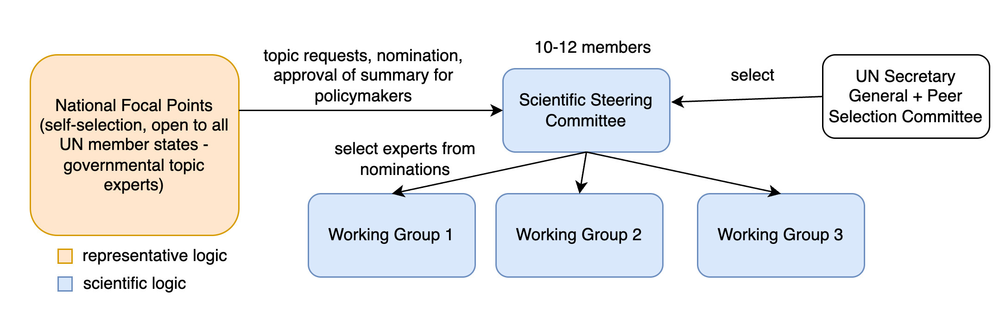
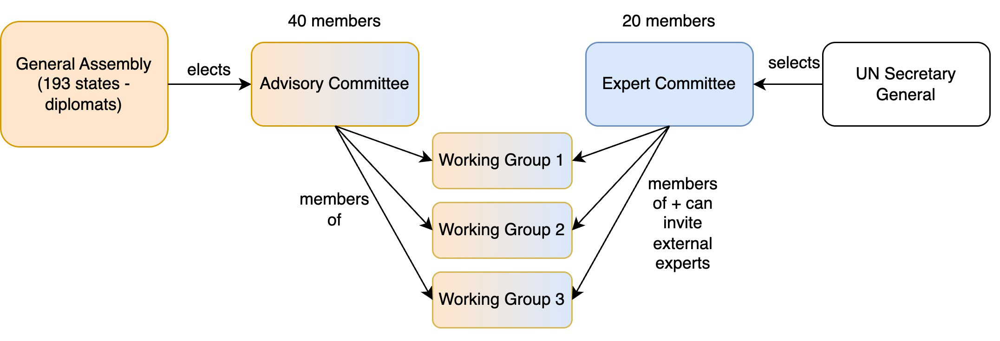
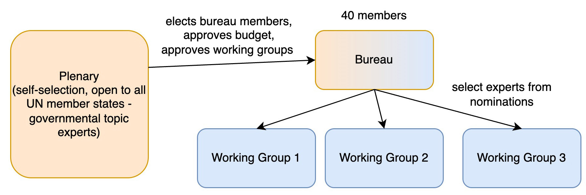

Member States and other stakeholders have been invited to submit their responses to the [Zero Draft](https://www.un.org/global-digital-compact/sites/default/files/2025-03/ai_panel_and_dialogue_zero_draft_19_march_2025.pdf) for the modalities of the [Independent International Scientific Panel on AI and the Global Dialogue on AI Governance](https://www.simoninstitute.ch/blog/post/recommendations-for-the-independent-international-scientific-panel-on-ai-and-the-global-dialogue-on-ai-governance/). As highlighted in a separate blogpost we see the zero draft as a [good start](https://www.simoninstitute.ch/blog/post/response-to-the-zero-draft-on-the-independent-international-scientific-panel-on-ai-and-the-global-dialogue-on-ai-governance/). 

In this blogpost we discuss the proposal of the Group of 77 **with regards to the panel, which we had the chance to discuss with delegations following the publication of our own [recommendations](https://www.simoninstitute.ch/blog/post/recommendations-for-the-independent-international-scientific-panel-on-ai-and-the-global-dialogue-on-ai-governance/).** We think the G77 proposal merits an analysis for two reasons. First, because the group represents about two-thirds of UN member states. Second, because it is the most detailed proposal put forward by Member States so far in the negotiations.

## What the G77 proposes

In our own recommendations, we had proposed national focal points that provide policy relevance through their inputs and that meet at least once a year in a plenary to review the summary for policymakers of the Annual global AI assessment, both as a forcing function for engagement and timelines as well as to provide it with political legitimacy.

However, we have also emphasized that protecting scientific independence in scientific steering and working groups is crucial to deliver state-of-the-art work at a fast speed.

In comparison, the zero draft by the co-facilitators proposes two main steering bodies:

* An Advisory Committee, which largely follows a representative logic and is a geographically balanced subset of experts elected by the General Assembly.
* An Expert Committee, for which there is an open nomination process with selection based on scientific criteria by the UN Secretary General. 
* The working groups consist of members of both groups, but the Expert Committee can invite more external experts as needed.

In contrast, the G77 suggests universal participation of UN Member States in a plenary. This de-facto replaces the Advisory Committee, with the important caveat, that plenary members are there to provide input and review, not to draft the report. Furthermore, the G77 has renamed the Expert Committee as the Bureau, which oversees the scientific work, but is elected by the plenary to be geographically representative. The terms “plenary” and “bureau” align with the IPCC.

## What the G77 proposal gets right

Overall, we think that the G77 proposal has many good elements, in particular the following three core strengths:

### 1. Universal membership in the plenary

As highlighted [before](https://www.simoninstitute.ch/blog/post/response-to-the-zero-draft-on-the-independent-international-scientific-panel-on-ai-and-the-global-dialogue-on-ai-governance/), we think that a body with universal membership provides more legitimacy than a smaller Advisory Committee selected in personal capacity but based on geographic and other representation criteria. The Plenary, as the G77 calls it, is practically a meeting once or twice a year. It is more straightforward than having the General Assembly elect an Advisory Committee as a sub-body of states that meet at a higher frequency (as suggested by the zero draft). The goal of a representative structure is to provide an avenue for exchange between governmental experts and report authors. The expectation is not that the governmental experts coordinate to synthesize the scientific research and draft the report. Given that the IPCC plenary approval of the Summary for Policymakers [does not significantly affect](https://apps.ipcc.ch/eventmanager/documents/87/160720240616-Doc.%2010%20-%20Strategic%20Planning%20Schedule.pdf) speed despite a consensus format, we think it is unlikely that universality would slow down the AI panel’s speed.

###  2. Independent working groups

The G77 clearly highlights the need for working groups with independent experts, that are neither the governmental experts in the Plenary/Advisory Committee, nor the scientific steering members in what the Zero Draft calls the Expert Committee and the G77 calls the Bureau. We agree that we should be [cautious](https://www.simoninstitute.ch/blog/post/response-to-the-zero-draft-on-the-independent-international-scientific-panel-on-ai-and-the-global-dialogue-on-ai-governance/) about direct involvement of governmental experts in working groups that draft reports to protect scientific independence. While we think it’s preferable to [pre-set](https://www.simoninstitute.ch/blog/post/recommendations-for-the-independent-international-scientific-panel-on-ai-and-the-global-dialogue-on-ai-governance/) the first iteration of working groups, we like the G77 suggestion of an adaptive way of forming working groups. The Expert Committee/Bureau suggests working groups based on research priorities, and the plenary can review this once a cycle.

In this context, we also note that, counterintuitively, the size of the panel is no good indicator for the cost of the panel. As [a review](https://www.cambridge.org/core/services/aop-cambridge-core/content/view/41595DD505026B0DAB58F975C03594E6/9781316514276AR.pdf/A_Critical_Assessment_of_the_Intergovernmental_Panel_on_Climate_Change.pdf?event-type=FTLA#page=66) of the IPCC model formulated it “the IPCC is both large – in relation to the number of contributors who participate in its activities and the assessment function it provides – and small – in relation to its material reality and physical footprint”. If the panel follows the example of previous panels like the [IPCC](https://apps.ipcc.ch/eventmanager/documents/83/181120230628-Doc.%202-Prog.%20and%20Budget.pdf#page=13) and IPBES in using independent scientists that are primarily employed by academic or research institutions, we would expect costs on the order of 5-10 million USD per year. That’s roughly the price tag of a large McKinsey study. 

Furthermore, fully leveraging existing networks and institutions with relevant expertise as technical support units for working groups de facto unburdens the AI panel budget. For the IPCC, the administrative secretariat is already the single biggest cost item. If Member States would design a panel without working groups, its secretariat would not only be administrative but de-facto draft the report, thereby increasing the personnel costs and the panel budget.

###  3. Agility in publishing panel outputs

While the G77 proposal is more heavily inspired by the IPCC and IPBES than most other proposals, it does acknowledge the need for higher speed in the case of AI. On top of the annual main synthesis report, the group allows the panel to “issue thematic briefs or special assessments in response to urgent developments or emerging global needs related to artificial intelligence, or commission reports as deemed necessary.” We think this flexibility is crucial to deal with the pace of technological developments.

## Areas of improvement

The following are three areas where we think the G77 should be open to compromise.

### 1. A clearer and balanced role for the plenary

Member State involvement helps to ensure that the panel works on policy-relevant questions and that many countries trust the panel’s findings and engage with them. However, member state involvement can also introduce risks to scientific credibility, independence, and speed. Therefore, how can a Plenary guarantee meaningful involvement of Member States without compromising scientific independence?

A Plenary should provide multiple avenues for governmental experts of all countries to ensure that their priorities are heard and that they can raise any blindspot authors may have. The G77 still leaves some ambiguities in defining the role of the plenary. For example, it’s not entirely clear what the following proposition entails: “the Plenary shall contribute its views to the work of the Panel’s outputs led by the Bureau including  thematic priorities to be operationalized by the Bureau, Working Group focus areas, as well as, the draft annual synthesis report and assessments and technical briefs produced by the Working Groups”. We think the plenary’s role should include non-binding inputs on thematic priorities, the review of working groups, and the review of the summary for policymakers of annual AI assessments (a shorter report that summarizes the longer working group reports). In return, we would caution against the Plenary being able to elect the Expert Committee/Bureau, to guarantee scientific independence and selection based on clearly defined, scientific criteria. 

### 2. Limiting demographic representativeness requirements for the Expert Committee/Bureau and the authors

The G77 proposal states that members of the Expert Committee/Bureau are selected in personal capacity, based on expertise, and with clear disclosure of conflict of interests. We strongly support these selection criteria because they enhance the panel’s independence and scientific excellence. However, there is a tension between these criteria and the following additional demands made by the G77:

* in electing members of the Bureau, the Plenary shall distribute the forty seats equitably among the UN regional groups
* with due consideration of the candidates’ (…) geographical representation and gender balance
* include one chair and four vice-chairs, taking due account of the principle of geographical balance among the five United Nations regions

These demands come from an understandable willingness to ensure the Bureau/expert committee reflects the global population’s diversity. Yet, we fear that these criteria would politicize the panel and make the selection of authors slower. Why? The global population and the population of AI researchers have different characteristics:

* The top 6 countries account for [approximately 75%](https://archivemacropolo.org/interactive/digital-projects/the-global-ai-talent-tracker/) of the world’s leading AI researchers.
* About a dozen countries have public AI Safety Institutes with the capacity to conduct rigorous AI model evaluations. Even among these, capabilities vary significantly. As of today, the only public full-scale pre-deployment assessments of frontier AI models have been conducted by [UK AISI](https://www.aisi.gov.uk/work/pre-deployment-evaluation-of-anthropics-upgraded-claude-3-5-sonnet) and [US AISI](https://www.nist.gov/news-events/news/2024/12/pre-deployment-evaluation-openais-o1-model).
* The [vast majority](https://www.digital-science.com/tldr/article/in-the-spotlight-english-as-the-lingua-franca-in-science/) (80%+) of scientific research is in English.
* The exact number varies based on methodology but women are [~20% of AI researchers](https://syncedreview.com/2020/03/13/exploring-gender-imbalance-in-ai-numbers-trends-and-discussions/).

This unequal distribution of expertise on AI is a systemic issue. Better pipelines and capacity-building programs may help tackle this, but this will take years, if not decades. The composition of the panel, however, does not change the underlying reality. We understand concerns that all authors have biases. However, a structured review process should leave ample room to highlight any specific shortcoming of any specific section in a report. Even for a review of the [demographic biases of AI models](https://pages.nist.gov/frvt/html/frvt_demographics.html) the reliability of the results depends on methodological quality, not on the demographics of the scientists testing and measuring the AI models. Hence, instead of focusing on the immutable characteristics of scientists, we recommend designing a scientific process with transparency, reproducibility, and review.

To be clear, this push for representativeness criteria is also found in other proposals, notably by some Western stakeholders. While they tend to be cautious towards geographic balance and Member State involvement to protect the scientific independence and speed of the panel at all costs, their representativeness demands can create similar trade-offs.

A tendency towards “[Everything-Bagel Liberalism](https://www.nytimes.com/2023/04/02/opinion/democrats-liberalism.html)”, i.e., loading a policy instrument with many secondary, orthogonal criteria, has negatively impacted speed in several contexts. In the context of scientific panels, the IPBES ensures authors [represent](https://www.ipbes.net/second-global-assessment/experts-nomination/notification) a “diverse range of backgrounds, disciplines and knowledge systems, including Indigenous and local knowledge systems, and have regional and gender balance”. As a consequence of these criteria, calls for authors become longer and more complex in order to identify and select candidates with the right demographic criteria. This trade-off may well be worth it for biodiversity. However, global scientific assessments on AI are highly time-sensitive and require faster report cycles than global biodiversity assessments. Hence, we recommend Member States to limit additional constraints to the identification and selection of experts that are not directly related to their demonstrated ability to adequately synthesize research knowledge on specific topics.

Provided that the Expert Committee / Bureau is not designed to be a representative body, it would then also not need to have 40 members. In contrast to the plenary, this body would profit from extensive, synchronous coordination to draft outlines, which we think works better in a smaller, more nimble body with a very high talent density.

### 3. Review of the mandate as a means for adaptation

The G77 expressed reluctance to consider a review of the mandate for the panel during the 82nd session of the General Assembly (late 2027). We agree that AI is here to stay for the long run and seems poised to become more important [by 2027](https://ai-2027.com/). Yet we don’t think that a review of the mandate contradicts the importance of AI, nor the value of UN mechanisms. 

It’s precisely because AI is changing fast that we think it is adequate to occasionally review the mandate for the panel and the dialogue. Keeping the flexibility to keep, adapt, or sunset the mandate over time provides agility. If the panel and the dialogue effectively fail to deliver value, it’s desirable to consider alternatives. Conversely, if in two and a half years, UN Member States want to take urgent action on AI, they will be able to refine the panel and establish other structures with higher ambition levels.

## Finding common ground

We appreciate that the G77 has submitted a detailed proposal, and are grateful to all stakeholders for their continued constructive engagement. We think the outstanding work remains in different groups of countries coming together to move towards a “landing zone” that is acceptable to all parties.